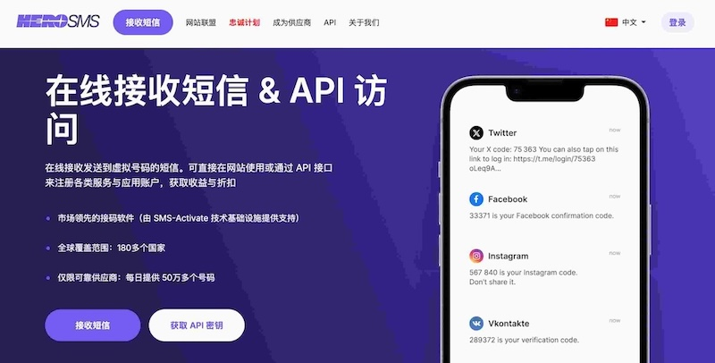

# HeroSMS 接码平台最新官网地址(内附85折促销码)

HeroSMS 是一个提供海外短信验证码接收服务的在线接码平台，支持全球 200+ 国家虚拟手机号，可用于 Telegram、WhatsApp、TikTok、Google 等平台账号注册与短信验证。随着 SMS-Activate 停止运营，越来越多用户开始转向 HeroSMS。本页面整理了 HeroSMS 接码平台最新官网地址、平台介绍、主要功能以及使用方法，帮助用户快速找到官方入口并了解如何使用 HeroSMS 接收短信验证码。

- **HeroSMS 官网地址：**  👉 [https://herosms.com](https://go2lk.pages.dev/p72h6b)

**优惠活动**

促销码：`clashsub`
优惠码说明：最高享85折优惠
截止时间：长期有效

## 🚀 HeroSMS 平台简介

HeroSMS 是一个提供 **在线短信接码服务** 的平台，用户可以租用来自全球多个国家的虚拟手机号，用于接收各种网站或应用发送的短信验证码。

常见用途包括：

- 注册海外网站账号  
- 接收短信验证码  
- 测试应用注册流程  
- API 自动化接码  

目前平台支持的验证码服务包括：

- Telegram  
- WhatsApp  
- TikTok  
- Google  
- Facebook  
- 以及更多海外平台

---

## 🌍 支持国家

HeroSMS 提供 **200+ 国家和地区** 的虚拟号码资源，例如：

- 🇺🇸 美国
- 🇬🇧 英国
- 🇨🇦 加拿大
- 🇮🇳 印度
- 🇮🇩 印尼
- 🇵🇭 菲律宾
- 🇻🇳 越南

不同国家的号码价格和库存会有所不同。

---

## ⚡ 平台特点

HeroSMS 相比传统接码平台，具有以下特点：

- **号码资源丰富**：支持全球多个国家虚拟号码  
- **到码速度快**：多数验证码 10–30 秒内可收到  
- **支持 API 接口**：可实现自动化接码  
- **操作简单**：界面和流程与 SMS-Activate 类似  
- **价格相对便宜**：按验证码次数收费

对于需要 **批量接码或自动化注册** 的用户来说，HeroSMS 上手成本很低。

---

## 🧭 使用教程

使用 HeroSMS 接收验证码一般只需要几个步骤：

1. 注册 HeroSMS 账号  
2. 充值账户余额  
3. 选择需要接码的平台  
4. 获取虚拟手机号  
5. 在目标网站填写号码  
6. 在后台查看验证码  

整个过程通常只需要几十秒。

---

## 🔧 API 自动化接码

HeroSMS 提供 API 接口，开发者可以实现自动化接码，例如：

- 自动获取手机号  
- 自动读取验证码  
- 自动释放号码  

适用于：

- 自动化脚本  
- 批量账号注册  
- 软件测试环境  

具体接口文档可以在官网后台查看。

---

## ⚠️ 使用注意事项

使用接码平台时需要注意：

- 虚拟号码通常为 **一次性号码**
- 不建议绑定重要账号
- 部分平台可能会限制虚拟号码注册
- 不同国家号码成功率不同

建议根据实际需求选择合适的号码地区。

---

## 📊 为什么很多用户选择 HeroSMS

在 **SMS-Activate 停运之后**，HeroSMS 逐渐成为不少用户的替代方案，主要原因包括：

- API 兼容性高  
- 使用方式相似  
- 号码资源稳定  
- 接码速度较快  

如果你之前使用过 SMS-Activate，那么迁移到 HeroSMS 几乎没有学习成本。

---

## ⭐ 免责声明

本仓库仅用于分享接码平台信息和官网地址，不提供任何账号注册服务。  
请用户遵守当地法律法规，并合理使用相关服务。

---

## 📌 Star 支持

如果这个仓库对你有帮助，可以点个 **⭐ Star** 支持一下。

同时也欢迎提交 Issue，帮助补充 **HeroSMS 最新官网地址或使用经验**。
